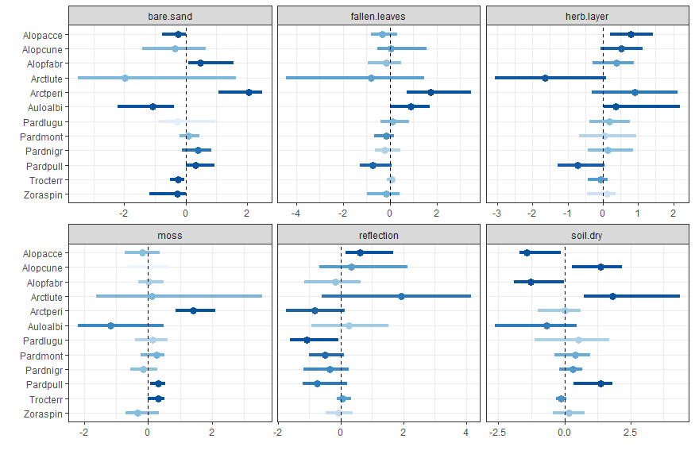
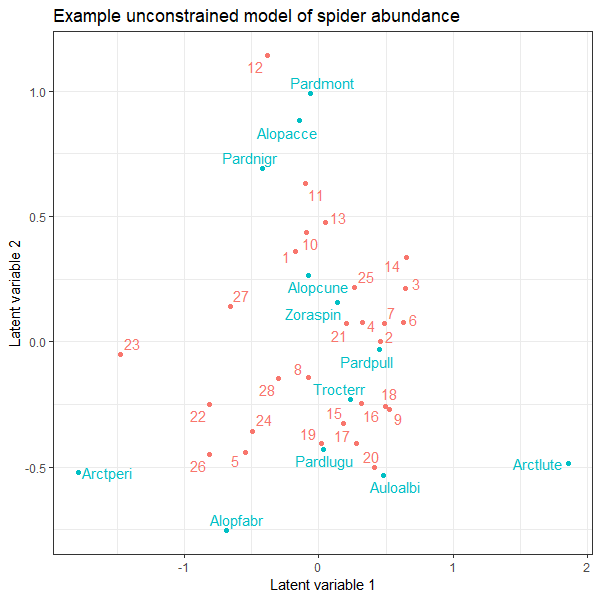
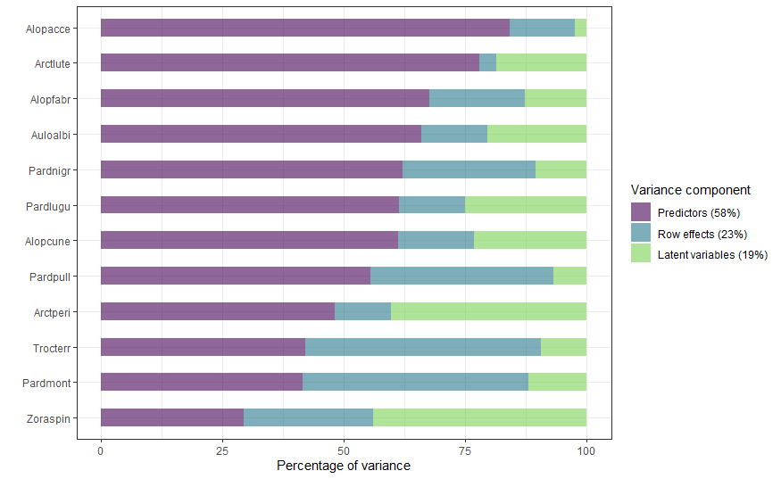

# ggboral - Plot boral model results with ggplot

This package contains ggplot alternatives to the base R plotting functions in the boral package.
At the moment it is mainly intended for my own use and is very basic, but feedback and pull
requests are welcome. If it develops sufficiently I'll contribute it to CRAN. 

At this early stage, the code is very fluid (ie. experimental) so don't depend on functions
having the same names or argument lists from one revision to the next.

To install the package from the R or RStudio console:
```
# Install devtools if not already on your system
install.packages("devtools")

devtools::install_github("mbedward/ggboral")
```
Share and enjoy!


## Some examples

`gg_coefsplot` is an alternative to `boral::coefsplot` that draws caterpillar plots for 
regression coefficients from a boral model.



`gg_lvsplot` is an alternative to `boral::lvsplot` to display an ordination-style graph of
latent variables.



`gg_varpart` graphs estimates of variance partitions as estimated by the boral function
`calc.varpart`.



